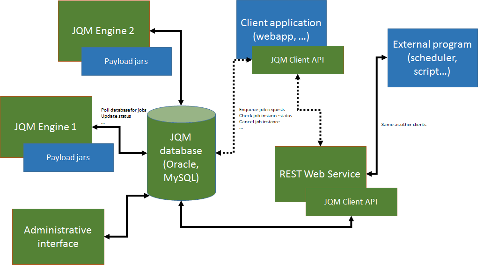

# How JQM works

## Concepts

The goal of JQM is to launch payloads, i.e. Java code doing something useful for the end user, aysnchronously.
The payload is described inside a job definition - so that JQM knows things like the class to load, the path of the jar file, etc.
A running payload is called a job instance (the "instance of the job definition"). To create a job instance, a job request
is emitted by a client. It contains things such as parameter values, and references a job definition so that JQM will know what to run.

## Definitions

| Name | Definition | 
| ------- | ----------- | 
| Payload | the actual Java code that runs inside the JQM engine, containing business logics | 
| Job Definition | the metadata describing the payload. Also called JobDef. Entirely described inside the JobDef XML file. Identified by a name called "Application Name" |
| Job Request | the action of asking politely the execution of a JobDef (which in turn means running the payload) |
| Job Instance | the result of of a Job Request. It obeys the Job Instance lifecycle (enqueued, running, endded, ...) |
| JQM Node | an instance of the JQM service that can run payloads |
| JQM Engine | synonym to JQM Node |

## General architecture

On this picture, JQM elements are in green while non-JQM elements are in blue.

JQM works like this:

* an application (for example, a J2EE web app but it could be anything as long as it can use a Java SE library) needs to launch an asynchronous job
* it imports the JQM client (one of the two - web service or direct-to-database. There are two dotted lines representing this option on the diagram)
* it uses the enqueue method of the client, passing it a job request with the name of the job definition to launch (and potentially parameters, tags, ...)
* a job instance is created inside the database
* engines are polling the database (see below). One of them with free room takes the job instance
* it creates a classloader for this job instance, imports the correct libraries inside it, launches the payload inside a thread
* during the run, the application that was at the origin of the request can use other methods of the client API to retrieve the status, the advancement, etc. of the job instance
* at the end of the run, the JQM engine updates the database and is ready to accept new jobs. The client can still query the history of executions.

It should be noted that clients never speak directly to a JQM engine - it all goes through the database. There is only one exception to this:
when job instances create files that should be retrieved by the requester, the requester will download the files through a direct HTTP GET call to
the engine. This avoids creating and maintaining a central file repository.

## Nodes, queues and polling

As it names entails, JQM is actually a queue manager. As many queues as needed can be created. A queue contains job instances waiting to be executed.

An engine (a node) is associated to as many queues as needed. The engine will poll job instances that are posted on these queues.
The polling frequency is defined per node/queue association: it is possible to have one engine polling very often a queue while
another polls slowly the same queue (minimum period: 1s). Also, the number of slots is defined at the same level: one engine may be able to run 10 jobs in parallel
while another, on a more powerful server, may run 50. When all slots of all nodes polling a given queue are filled, job instances stay in the queue, waiting for a slot
to be freed. Note that it also allows some queues to be defined only on some nodes and not others, therefore giving some control over where payloads are
actually run.

A Job definition is associated to a queue. It is the jobdef default queue: all job requests pertaining to a jobdef are created inside the jobdef default queue. It
is possible, once created, to move a job instance from one queue to another.

By default, when creating the first engine, one queue is created and is tagged as the default queue (meaning all jobdef that do not have a specific queue
will end on this one).
